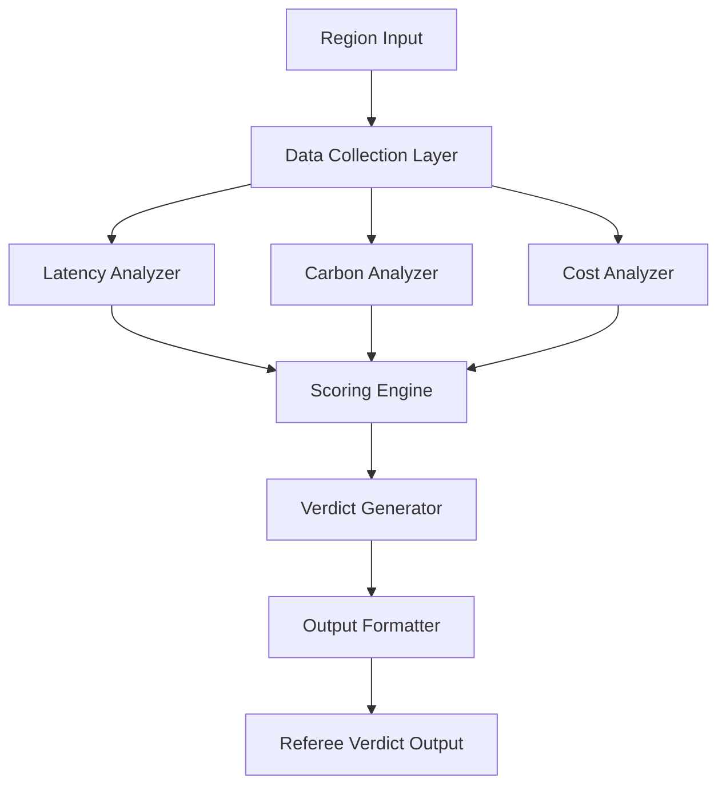

# Design Document: Region Arbitrator

## Overview

The Region Arbitrator is a decision-support system that evaluates cloud regions across three critical dimensions: latency (speed), carbon intensity (environmental impact), and cost (financial impact). The system provides referee-style verdicts with clear reasoning and sustainable alternatives, helping users make informed infrastructure decisions.

The system follows a scoring and weighting approach where each factor is normalized to a 0-100 scale, combined using configurable weights, and mapped to verdict categories with clear thresholds.

## Architecture

The system uses a modular architecture with clear separation of concerns:



**Key Components:**
- **Data Collection Layer**: Interfaces with external APIs and data sources
- **Analysis Modules**: Independent analyzers for each factor (latency, carbon, cost)
- **Scoring Engine**: Normalizes and combines factor scores using weighted algorithms
- **Verdict Generator**: Maps composite scores to referee verdicts with reasoning
- **Output Formatter**: Structures final output with verdict, reason, and suggestions

## Components and Interfaces

### RegionArbitrator (Main Interface)
```typescript
interface RegionArbitrator {
  evaluateRegion(region: CloudRegion): Promise<ArbitratorVerdict>
  evaluateMultipleRegions(regions: CloudRegion[]): Promise<ArbitratorVerdict[]>
  configureWeights(weights: FactorWeights): void
}
```

### Data Collection Layer
```typescript
interface DataCollector {
  getLatencyData(region: CloudRegion): Promise<LatencyMetrics>
  getCarbonData(region: CloudRegion): Promise<CarbonMetrics>
  getCostData(region: CloudRegion): Promise<CostMetrics>
}

interface LatencyMetrics {
  averageLatency: number // milliseconds
  p95Latency: number
  measurementTimestamp: Date
  sourceLocation: string
}

interface CarbonMetrics {
  carbonIntensity: number // gCO2/kWh
  renewablePercentage: number
  dataSource: string
  lastUpdated: Date
}

interface CostMetrics {
  computeCostPerHour: number // USD
  storageCostPerGB: number // USD
  networkCostPerGB: number // USD
  region: string
}
```

### Analysis Modules
```typescript
interface LatencyAnalyzer {
  analyzeLatency(metrics: LatencyMetrics): LatencyScore
}

interface CarbonAnalyzer {
  analyzeCarbonImpact(metrics: CarbonMetrics): CarbonScore
}

interface CostAnalyzer {
  analyzeCost(metrics: CostMetrics): CostScore
}

interface FactorScore {
  score: number // 0-100 normalized score
  confidence: number // 0-1 confidence level
  reasoning: string
}
```

### Scoring and Verdict Generation
```typescript
interface ScoringEngine {
  combineScores(
    latency: LatencyScore, 
    carbon: CarbonScore, 
    cost: CostScore, 
    weights: FactorWeights
  ): CompositeScore
}

interface VerdictGenerator {
  generateVerdict(score: CompositeScore, region: CloudRegion): ArbitratorVerdict
  suggestGreenAlternative(region: CloudRegion): GreenSuggestion
}

interface FactorWeights {
  latency: number // 0-1, default 0.4
  carbon: number // 0-1, default 0.3  
  cost: number // 0-1, default 0.3
}
```

## Data Models

### Core Models
```typescript
interface CloudRegion {
  provider: 'AWS' | 'Azure' | 'GCP' | 'Other'
  regionCode: string // e.g., 'us-west-2', 'eastus', 'us-central1'
  displayName: string
  location: GeographicLocation
}

interface GeographicLocation {
  country: string
  city?: string
  latitude: number
  longitude: number
}

interface ArbitratorVerdict {
  region: CloudRegion
  verdict: 'Red Card' | 'Yellow Card' | 'Play On'
  reason: string
  suggestion: GreenSuggestion
  scores: {
    latency: LatencyScore
    carbon: CarbonScore
    cost: CostScore
    composite: CompositeScore
  }
  timestamp: Date
}

interface GreenSuggestion {
  type: 'alternative_region' | 'optimization_strategy' | 'no_better_option'
  description: string
  alternativeRegion?: CloudRegion
  expectedImpact?: string
}
```

### Scoring Models
```typescript
interface CompositeScore {
  overallScore: number // 0-100
  weightedBreakdown: {
    latency: number
    carbon: number
    cost: number
  }
  confidence: number // 0-1
}

type LatencyScore = FactorScore & {
  category: 'excellent' | 'good' | 'acceptable' | 'poor'
}

type CarbonScore = FactorScore & {
  category: 'very_clean' | 'clean' | 'moderate' | 'high_carbon'
  renewablePercentage: number
}

type CostScore = FactorScore & {
  category: 'very_affordable' | 'affordable' | 'moderate' | 'expensive'
  relativeCostIndex: number
}
```

## Correctness Properties

*A property is a characteristic or behavior that should hold true across all valid executions of a system—essentially, a formal statement about what the system should do. Properties serve as the bridge between human-readable specifications and machine-verifiable correctness guarantees.*

After reviewing the prework analysis, several properties can be consolidated to eliminate redundancy. For example, properties about data freshness can be combined, and verdict logic properties can be streamlined.

### Property 1: Complete Factor Analysis
*For any* valid cloud region, evaluation should analyze all three factors (latency, carbon intensity, cost) and return valid scores for each
**Validates: Requirements 1.1**

### Property 2: Latency Analysis Correlation
*For any* set of regions with known geographic distances, latency scores should generally correlate with proximity (closer regions tend to have better latency scores)
**Validates: Requirements 1.2**

### Property 3: Carbon Analysis Integration
*For any* region with carbon metrics, the carbon score should properly incorporate both carbon intensity values and renewable energy percentages
**Validates: Requirements 1.3**

### Property 4: Cost Analysis Comprehensiveness
*For any* region with cost data, the cost score should incorporate multiple pricing dimensions (compute, storage, network costs)
**Validates: Requirements 1.4**

### Property 5: Verdict Format Compliance
*For any* valid region evaluation, the output should contain exactly one verdict from the set {Red Card, Yellow Card, Play On}
**Validates: Requirements 2.1**

### Property 6: Verdict Logic Consistency
*For any* region with consistently poor scores across all factors, the verdict should be Red Card; for consistently good scores, Play On; for mixed scores, Yellow Card
**Validates: Requirements 2.2, 2.3, 2.4**

### Property 7: Reasoning Completeness
*For any* verdict, the reason should be a non-empty string that mentions the relevant factors (latency, carbon, cost) that influenced the decision
**Validates: Requirements 3.1, 3.2**

### Property 8: Green Suggestion Presence
*For any* verdict, a green suggestion should be provided with a valid type and non-empty description
**Validates: Requirements 4.1**

### Property 9: Green Alternative Prioritization
*For any* suggested alternative region, it should have a better (lower) carbon score than the original region being evaluated
**Validates: Requirements 4.2**

### Property 10: Optimization Strategy Fallback
*For any* region where no better environmental alternatives exist in the available region set, the suggestion type should be 'optimization_strategy' or 'no_better_option'
**Validates: Requirements 4.3**

### Property 11: Multi-Region Independence
*For any* region, evaluating it individually should produce the same verdict and scores as evaluating it within a batch of multiple regions
**Validates: Requirements 5.1, 5.2**

### Property 12: Multi-Region Output Distinction
*For any* batch of multiple regions, each region should receive its own distinct verdict and reasoning in the output
**Validates: Requirements 5.3**

### Property 13: Data Freshness Validation
*For any* evaluation, all data sources (latency, carbon, cost) should have timestamps within acceptable freshness thresholds
**Validates: Requirements 6.1, 6.2, 6.3**

### Property 14: Uncertainty Indication
*For any* evaluation with stale data or low confidence scores, the verdict should include uncertainty indicators or confidence qualifiers
**Validates: Requirements 6.4**

## Error Handling

The system implements comprehensive error handling across all components:

### Data Collection Errors
- **Network timeouts**: Retry with exponential backoff, fallback to cached data if available
- **API rate limits**: Implement request queuing and respect rate limit headers
- **Invalid responses**: Validate data schemas and reject malformed responses
- **Missing data**: Use confidence scoring to indicate incomplete information

### Analysis Errors
- **Invalid metrics**: Validate input ranges and handle edge cases gracefully
- **Calculation errors**: Implement bounds checking and mathematical error handling
- **Scoring failures**: Provide default scores with low confidence when analysis fails

### Configuration Errors
- **Invalid weights**: Validate that factor weights sum to 1.0 and are non-negative
- **Missing regions**: Handle unknown region codes with appropriate error messages
- **Malformed inputs**: Validate all input parameters and provide clear error descriptions

### Output Generation Errors
- **Formatting failures**: Ensure all required fields are present in output
- **Verdict mapping errors**: Handle edge cases in score-to-verdict mapping
- **Suggestion generation failures**: Provide fallback suggestions when primary logic fails

## Testing Strategy

The testing approach combines unit tests for specific scenarios with property-based tests for comprehensive validation:

### Unit Testing
- **Component isolation**: Test each analyzer (latency, carbon, cost) independently
- **Edge cases**: Test boundary conditions, empty inputs, and error scenarios
- **Integration points**: Test data flow between components
- **Specific examples**: Test known region scenarios with expected outcomes

### Property-Based Testing
- **Universal properties**: Validate that properties hold across all generated inputs
- **Test configuration**: Minimum 100 iterations per property test
- **Input generation**: Smart generators that create realistic region data
- **Property annotation**: Each test tagged with format: **Feature: region-arbitrator, Property N: [property description]**

### Testing Framework
The system will use **fast-check** for property-based testing in TypeScript, providing:
- Sophisticated input generators for cloud regions and metrics
- Shrinking capabilities to find minimal failing examples
- Integration with standard testing frameworks (Jest/Vitest)

### Test Data Strategy
- **Synthetic data**: Generated test regions with controlled characteristics
- **Real-world samples**: Curated dataset of actual cloud regions for validation
- **Edge case coverage**: Extreme values, missing data, and error conditions
- **Performance testing**: Validate response times and resource usage under load

<function_calls>
<invoke name="prework">
<parameter name="featureName">region-arbitrator