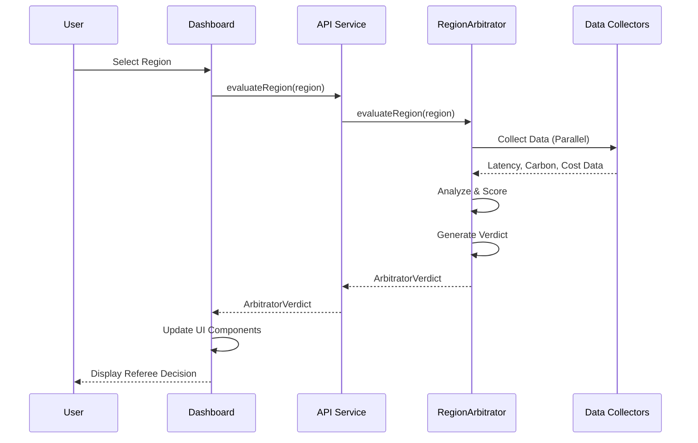

# Region Arbitrator - Dashboard Integration Guide

This document explains how the Region Arbitrator Dashboard integrates with the TypeScript backend and provides guidance for development and deployment.

## 🏗️ Integration Architecture

The Region Arbitrator system consists of two main components that work together:

```
┌─────────────────────────────────────────────────────────────────┐
│                    Region Arbitrator System                     │
├─────────────────────────────────┬───────────────────────────────┤
│          Backend Engine         │        Dashboard UI           │
│                                 │                               │
│  📊 Data Collection Layer       │  🗺️  Interactive World Map    │
│  • Electricity Maps API        │  • AWS Region Markers         │
│  • AWS Pricing API             │  • Verdict Color Coding       │
│  • Latency Measurements        │  • Hover & Selection States   │
│                                 │                               │
│  🔬 Analysis Modules            │  🏟️  Referee's Card Panel     │
│  • Carbon Analyzer             │  • Verdict Display            │
│  • Latency Analyzer            │  • Reasoning Explanation      │
│  • Cost Analyzer               │  • Green Suggestions          │
│                                 │                               │
│  ⚖️  Scoring Engine             │  📈 VAR Analysis Charts       │
│  • Weighted Combination        │  • Radar Chart (Trade-offs)   │
│  • Referee Logic Rules         │  • Carbon Forecast Chart      │
│  • Confidence Scoring          │  • Live Ticker Updates        │
│                                 │                               │
│  🎯 Verdict Generator           │  ⚙️  Configuration Panel      │
│  • Red/Yellow/Play On/Blue     │  • Weight Adjustments         │
│  • Reasoning Generation        │  • Real-time Updates          │
│  • Green Alternatives          │  • Keyboard Navigation        │
└─────────────────────────────────┴───────────────────────────────┘
```

## 🔗 Integration Points

### 1. Direct Import Integration

The dashboard directly imports and uses the backend RegionArbitrator:

```typescript
// dashboard/src/services/api.ts
import { CloudRegionArbitrator } from '../../../src/RegionArbitrator'

class RegionArbitratorAPI {
    private arbitrator: CloudRegionArbitrator
    
    constructor() {
        this.arbitrator = new CloudRegionArbitrator()
    }
    
    async evaluateRegion(region: CloudRegion): Promise<ArbitratorVerdict> {
        return await this.arbitrator.evaluateRegion(region)
    }
}
```

### 2. Shared Type System

Both components use the same TypeScript interfaces:

```typescript
// Shared types between backend and dashboard
export interface ArbitratorVerdict {
    region: CloudRegion
    verdict: 'Red Card' | 'Yellow Card' | 'Play On' | 'Blue Card'
    reason: string
    suggestion: GreenSuggestion
    scores: {
        latency: LatencyScore
        carbon: CarbonScore
        cost: CostScore
        composite: CompositeScore
    }
    timestamp: Date
    refereeConfidence?: 'High' | 'Medium' | 'Low'
}
```

### 3. Real-time Data Flow



## 🚀 Development Workflow

### Quick Start

1. **Install all dependencies:**
   ```bash
   npm run full:install
   ```

2. **Start both backend and dashboard:**
   ```bash
   npm run full:dev
   ```

3. **Access the integrated system:**
   - Dashboard: http://localhost:3000
   - Backend API: Available through dashboard integration
   - Health Check: http://localhost:3000/api/health

### Development Commands

```bash
# Backend only
npm run dev                    # Start backend in development mode
npm run build                  # Build backend TypeScript
npm run test                   # Run backend tests

# Dashboard only
npm run dashboard:dev          # Start dashboard development server
npm run dashboard:build        # Build dashboard for production
npm run dashboard:start        # Start dashboard production server

# Full system
npm run full:install          # Install all dependencies
npm run full:dev              # Start both backend and dashboard
npm run full:build            # Build both components
```

## 🔧 Configuration Management

### Environment Variables

The system uses environment variables for configuration:

```bash
# Backend Configuration (.env)
ELECTRICITY_MAPS_API_KEY=your_api_key_here
AWS_REGION=us-east-1
LOG_LEVEL=info

# Dashboard Configuration (dashboard/.env.local)
NEXT_PUBLIC_ENABLE_REAL_API=true
NEXT_PUBLIC_DEFAULT_CARBON_WEIGHT=0.4
NEXT_PUBLIC_DEFAULT_LATENCY_WEIGHT=0.4
NEXT_PUBLIC_DEFAULT_COST_WEIGHT=0.2
```

### Referee Logic Configuration

The system follows the referee logic rules defined in `.kiro/steering/`:

```typescript
// Referee Scoring Logic
const DEFAULT_WEIGHTS = {
    carbon: 0.4,   // 40% - Environmental priority
    latency: 0.4,  // 40% - Performance priority  
    cost: 0.2      // 20% - Budget consideration
}

// Red Card Rule: Any individual score < 30 = Automatic Red Card
// Verdict Thresholds: <40 Red, 40-70 Yellow, >70 Play On
```

## 🎯 Key Integration Features

### 1. Real-time Region Evaluation

```typescript
// Dashboard hook that uses real backend
export function useRegionData() {
    const evaluateRegion = async (regionCode: string) => {
        const verdict = await regionArbitratorAPI.evaluateRegion(region)
        // Update UI with real verdict
        setVerdicts(prev => ({ ...prev, [regionCode]: verdict }))
        return verdict
    }
}
```

### 2. Batch Region Processing

```typescript
// Evaluate multiple regions with greenest-first sorting
const evaluatedVerdicts = await regionArbitratorAPI.evaluateMultipleRegions(regions)
// Results are automatically sorted with greenest region first
```

### 3. Dynamic Weight Configuration

```typescript
// Update referee weights in real-time
const updateWeights = (weights: FactorWeights) => {
    regionArbitratorAPI.configureWeights(weights)
    // UI updates immediately with new verdicts
}
```

### 4. Comprehensive Error Handling

```typescript
// Blue Card for data collection failures
if (error instanceof DataCollectionError) {
    return {
        verdict: 'Blue Card',
        reason: 'Technical Timeout - Data unavailable',
        // ... other fields
    }
}
```

## 📊 Data Flow Examples

### Single Region Evaluation

```typescript
// User clicks on us-west-2 region marker
const region = {
    provider: 'AWS',
    regionCode: 'us-west-2',
    displayName: 'US West (Oregon)',
    location: { country: 'United States', city: 'Oregon', ... }
}

// Dashboard calls API service
const verdict = await regionArbitratorAPI.evaluateRegion(region)

// Backend performs analysis
// 1. Collect data: latency, carbon, cost
// 2. Analyze each factor independently  
// 3. Apply referee scoring logic
// 4. Generate verdict with reasoning

// Result displayed in UI
{
    verdict: 'Play On',
    reason: 'The Referee approves this choice. Oregon benefits from 85% renewable energy...',
    scores: { carbon: 87, latency: 72, cost: 68, composite: 78 },
    suggestion: { type: 'optimization_strategy', description: '...' }
}
```

### Multi-Region Batch Evaluation

```typescript
// Dashboard loads all 10 AWS regions
const regions = AWS_REGIONS.map(r => convertToCloudRegion(r))
const verdicts = await regionArbitratorAPI.evaluateMultipleRegions(regions)

// Backend processes all regions in parallel
// Results sorted with greenest region first
// Dashboard updates map markers with verdict colors
```

## 🔍 Debugging and Monitoring

### Health Check Integration

```bash
# Check system health
curl http://localhost:3000/api/health

# Response includes both dashboard and backend status
{
    "status": "healthy",
    "services": {
        "dashboard": { "status": "healthy" },
        "regionArbitrator": { "status": "healthy", "configuration": {...} }
    },
    "referee": {
        "message": "🏟️ The Referee is ready and operational!",
        "confidence": "High"
    }
}
```

### Debug Logging

```typescript
// Enable debug logging
NEXT_PUBLIC_ENABLE_DEBUG_LOGGING=true

// Console output includes:
// 🏟️ The Referee is evaluating us-west-2...
// 📋 Referee Match Report: [detailed analysis]
// ⚖️ Scoring breakdown: Carbon 87, Latency 72, Cost 68
```

### Performance Monitoring

```typescript
// Built-in performance tracking
const startTime = Date.now()
const verdict = await evaluateRegion(region)
const responseTime = Date.now() - startTime

console.log(`🏟️ Referee evaluation completed in ${responseTime}ms`)
```

## 🚀 Deployment Integration

### Production Build

```bash
# Build both components
npm run full:build

# Deploy dashboard (includes backend)
cd dashboard
npm run build:production
npm run start:production
```

### Docker Deployment

```dockerfile
# Multi-stage build including both backend and dashboard
FROM node:18-alpine AS base

# Install backend dependencies
COPY package*.json ./
RUN npm ci --only=production

# Install dashboard dependencies  
COPY dashboard/package*.json ./dashboard/
RUN cd dashboard && npm ci --only=production

# Build both components
COPY . .
RUN npm run build
RUN cd dashboard && npm run build

# Production runtime
FROM node:18-alpine AS runner
COPY --from=base /app ./
EXPOSE 3000
CMD ["npm", "run", "dashboard:start"]
```

### Environment Configuration

```bash
# Production environment variables
NODE_ENV=production
NEXT_PUBLIC_ENABLE_REAL_API=true
NEXT_PUBLIC_ENABLE_DEBUG_LOGGING=false

# API keys and configuration
ELECTRICITY_MAPS_API_KEY=prod_key_here
AWS_REGION=us-east-1
```

## 🔐 Security Considerations

### API Key Management

```typescript
// Backend API keys are server-side only
// Dashboard only uses NEXT_PUBLIC_ variables for client-safe config
const apiKey = process.env.ELECTRICITY_MAPS_API_KEY // Server-side only
const enableRealAPI = process.env.NEXT_PUBLIC_ENABLE_REAL_API // Client-safe
```

### CORS and Security Headers

```typescript
// next.config.js includes security headers
async headers() {
    return [{
        source: '/(.*)',
        headers: [
            { key: 'X-Frame-Options', value: 'DENY' },
            { key: 'X-Content-Type-Options', value: 'nosniff' },
            // ... other security headers
        ]
    }]
}
```

## 📈 Performance Optimization

### Parallel Data Collection

```typescript
// Backend collects all data sources in parallel
const [latencyMetrics, carbonMetrics, costMetrics] = await Promise.all([
    this.dataCollector.getLatencyData(region),
    this.dataCollector.getCarbonData(region),
    this.dataCollector.getCostData(region)
])
```

### Efficient UI Updates

```typescript
// Dashboard uses React state management for efficient updates
const [verdicts, setVerdicts] = useState<Record<string, ArbitratorVerdict>>({})

// Batch updates for multiple regions
const updatedVerdicts = { ...verdicts }
evaluatedVerdicts.forEach(verdict => {
    updatedVerdicts[verdict.region.regionCode] = verdict
})
setVerdicts(updatedVerdicts)
```

### Caching Strategy

```typescript
// Built-in confidence scoring acts as cache validation
if (verdict.scores.composite.confidence < 0.6) {
    // Re-evaluate with fresh data
    return await this.evaluateRegion(region)
}
```

## 🎯 Next Steps

### Extending the Integration

1. **Add Persistent Storage:**
   ```typescript
   // Store user preferences and evaluation history
   interface UserPreferences {
       weights: FactorWeights
       favoriteRegions: string[]
       evaluationHistory: ArbitratorVerdict[]
   }
   ```

2. **Real-time Updates:**
   ```typescript
   // WebSocket integration for live data updates
   const ws = new WebSocket('ws://localhost:3001/live-updates')
   ws.onmessage = (event) => {
       const update = JSON.parse(event.data)
       updateRegionVerdict(update.regionCode, update.verdict)
   }
   ```

3. **Advanced Analytics:**
   ```typescript
   // Add trend analysis and prediction
   interface TrendAnalysis {
       carbonTrend: 'improving' | 'stable' | 'worsening'
       latencyTrend: 'improving' | 'stable' | 'worsening'
       costTrend: 'improving' | 'stable' | 'worsening'
       prediction: ArbitratorVerdict
   }
   ```

---

**The Referee and Dashboard are fully integrated and ready for action! 🏟️**

This integration provides a seamless experience where the sophisticated backend analysis is presented through an intuitive, interactive dashboard that helps users make informed cloud region decisions with confidence.